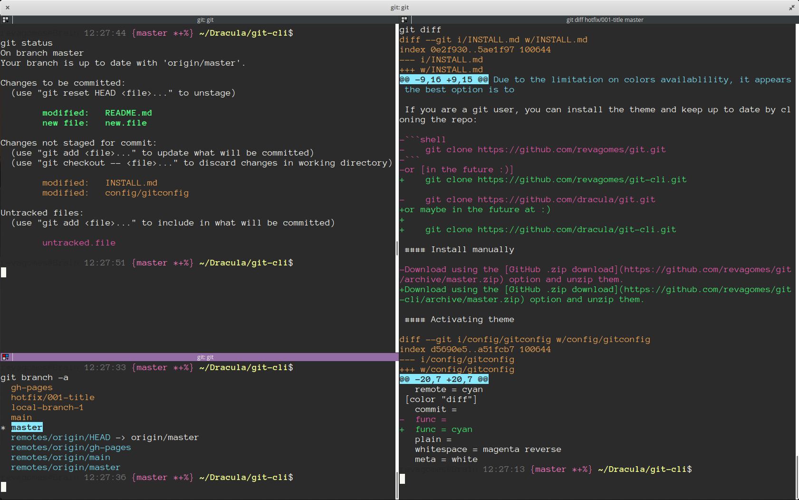

# Dracula for [Git](https://git-scm.com)

> A dark theme for [Git](https://git-scm.com).

## Install

All instructions can be found at [draculatheme.com/git](https://draculatheme.com/git).

## Team

This theme is maintained by the following person(s) and a bunch of [awesome contributors](https://github.com/dracula/foobar/graphs/contributors).

 |
--- |
[Reva Gomes](https://github.com/revagomes) |

## License

[MIT License](./LICENSE)
